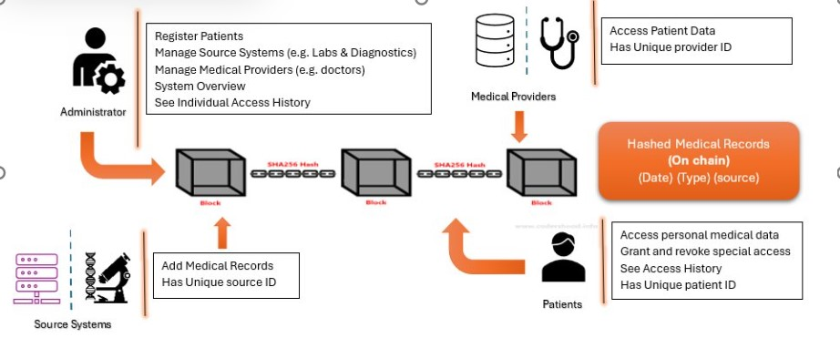

# 📖 eChartChain

A decentralized, patient-centered **Electronic Health Record (EHR)** system designed for **Manitoba, Canada**, built on **Ethereum blockchain technology** and **smart contracts**, aligned with the **Personal Health Information Act (PHIA)**.

This project addresses the limitations of Manitoba’s current centralized **eChart Manitoba** system by introducing a secure, privacy-focused, and patient-controlled healthcare data infrastructure.

---

## 🩺 Overview

Blockchain-based **eChartChain** redefines health record management by providing:
- ✅ **Secure, direct digital access** for patients to their health records.
- ✅ **Dynamic, patient-managed consent** for granting or revoking data access.
- ✅ **Blockchain-based audit logging** for transparency and accountability.
- ✅ **PHIA-compliant, decentralized design** with preserved regulatory oversight.
- ✅ **Reduced administrative overhead** through automated access management.

---

## ⚙️ Key Features

- **Ethereum Smart Contracts** to manage consent and access rights.
- **On-chain Access Logs** ensuring complete traceability.
- **Dynamic Consent Management** with real-time patient control.
- **Emergency Access Support** for authorized healthcare authorities.
- **PHIA-Compliant Security and Privacy Protections**
- **Hybrid Storage Design** — secure off-chain data with on-chain metadata.
- **Automated, Transparent, and Immutable Record-Keeping**

---

## 🛠️ Technologies

- **Ethereum Blockchain (Solidity)**
- **REMIX**
- **Smart Contracts**
- **Web3.js**
- **IPFS (optional for off-chain encrypted data storage)**

---

## 📸 System Architecture

*Figure: Decentralized eChartChain system architecture*

---

## 🔐 Compliance

This system is carefully designed to align with:
- **Personal Health Information Act (PHIA) — Manitoba**
- **PIPEDA — Canada**

---

## 📚 Future Work

- Integration with **Layer 2 blockchain solutions** for improved scalability and lower costs.
- **Formal smart contract security audits**.
- Expansion to other provinces and jurisdictions with adaptable regulatory compliance.

---

## 📖 Project Repository

GitHub Repository: [https://github.com/joydip10/eChartManitoba](https://github.com/joydip10/eChartManitoba)
